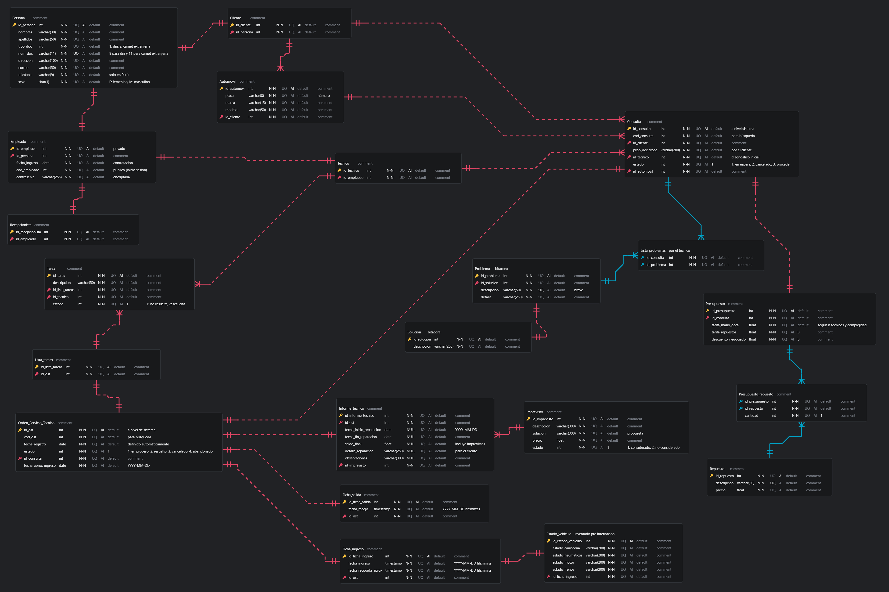

# Backend SIAMO
Backend del apliacativo móvil SIAMO para el curso de Desarrollo de Sistemas Móviles
Nota: Desde el pgAdmin cambiar las variable Money por Numeric

## Integrantes
- Paul Santillan
- Aracely Rivera
- Carolina Seminario

## Instrucciones de instalación
Crear un entorno virtual en python (de preferencia 3.11.0)
```
python -m venv venv
```
Inicializar el entorno virtual
```
.\venv\Scripts\activate
```
Instalar requerimientos
```
pip install -r .\requirements.txt
```
Crear .env con las siguiente variables de entorno
```
SERVER=postgresql
USER=postgres
PASSWORD=<put your password>
HOST=localhost
DATABASE=<databse_name>

CORS_ORIGINS=http://localhost:3000

SECRET_KEY=<generate a secret key>
JWT_SECRET_KEY=<generate a secret key>
JWT_ACCESS_TOKEN_EXPIRES=1
JWT_REFRESH_TOKEN_EXPIRES=2
```
Correr el archivo app.py
```
python .\app.py
```

## Modelo E/R de la base de datos
